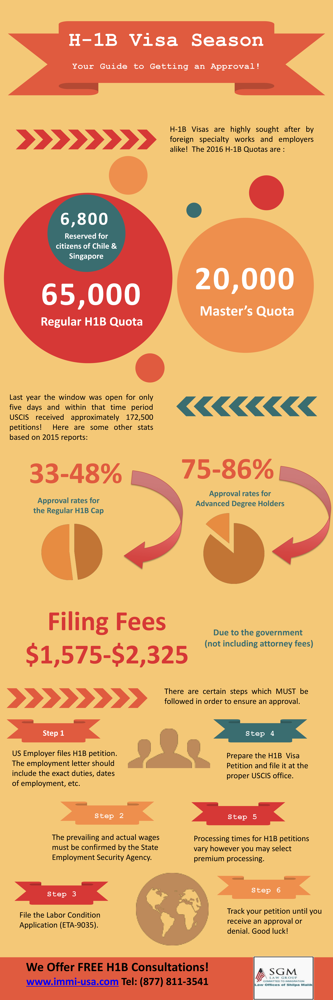
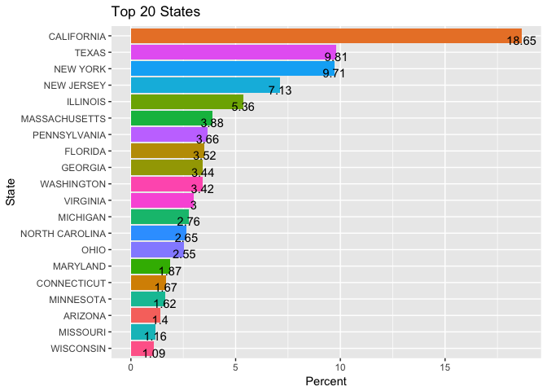
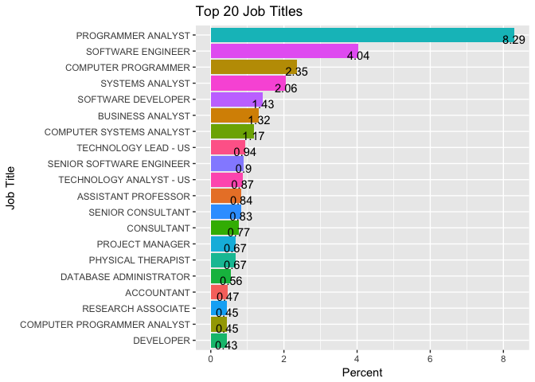
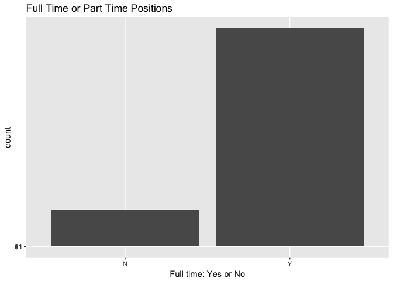
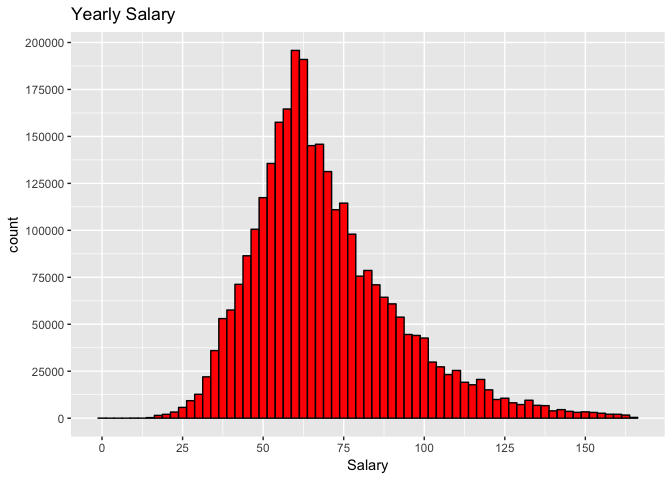
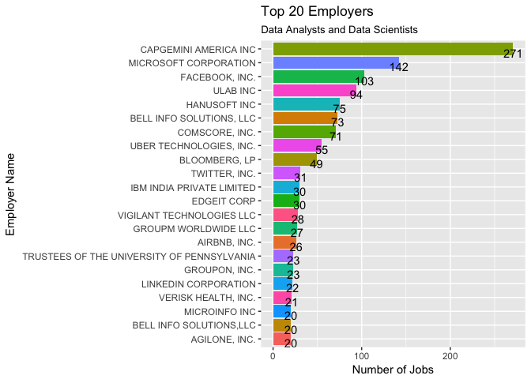
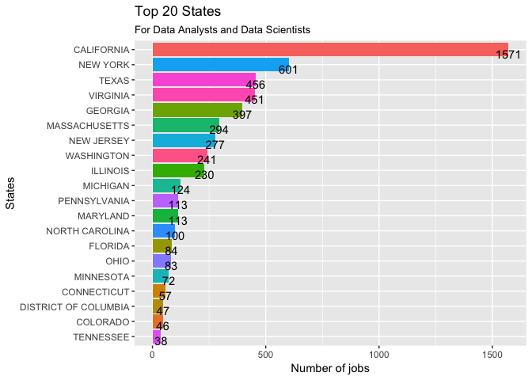
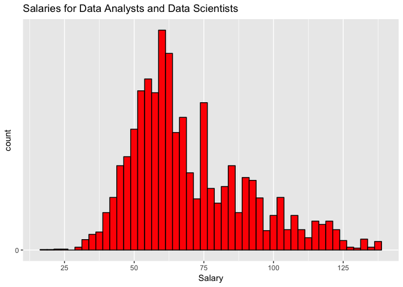
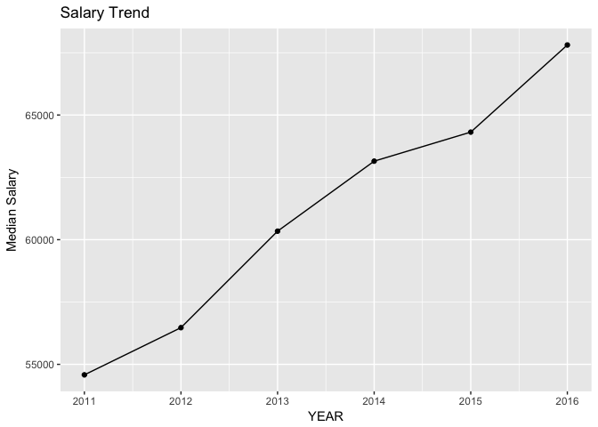
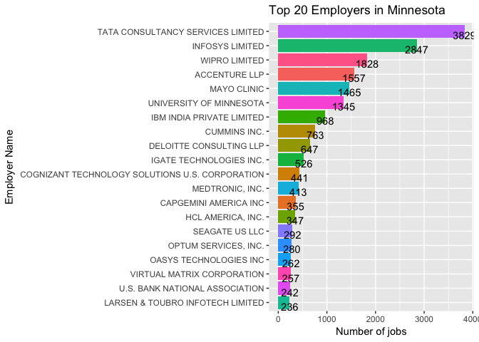

H1b Visa
================
2018-01-23

A closer look at the H1b visa applications from 2011 to 2016. This is an interesting data set today because of all the talk of cutting back on the number of H1b visas that will be allowed in the upcoming years. Thought this document I will explore the 3002458 rows in this data set.

because this is such a large data set I want to take the time to test the read times between read.csv with stringAsFactors = FALSE and read\_csv from the readr package.

    ##    user  system elapsed 
    ##   7.999   0.435   8.821

3002458 rows read\_csv read the 469 MB file into R in under 8 seconds, it also shows the data types meaning I can avoid having to call str(). It takes the standard read.csv 49.353 seconds, this over a 5X speed increase.

Before looking at the data I would like to better understand the process a H1b applicant must take to work in the United States. I found this info-graphic from (<http://www.immi-usa.com/h1b-application-process-step-by-step-guide/>).



This data set is from the website Kaggle.com that being said the data may not be 100 percent correct. Reading the forums on the kaggle website one field I and other found challenging is what does certified- withdrawn, withdrawn , certified and certified withdrawn mean?
The metadata says
**"The CASE\_STATUS field denotes the status of the application after LCA processing. Certified applications are filed with USCIS for H-1B approval. CASE\_STATUS: CERTIFIED does not mean the applicant got his/her H-1B visa approved, it just means that he/she is eligible to file an H-1B"**

A user of the forum posted this:
As part of H-1 processing, first step is to file LCA w/ DOL.

Certified: Employer filed the LCA, which was approved by DOL
Certified Withdrawn: LCA was approved but later withdrawn by employer
Withdrawn: LCA was withdrawn by employer before approval
Denied: LCA was denied by DOL.
I want to have a look at how this looks in the data.

``` r
status <- h1b %>% filter(!is.na(CASE_STATUS)) %>%
                  group_by(CASE_STATUS) %>% 
                  summarise(status = round(n()*100/nrow(h1b),1))

ggplot(status, aes(x = reorder(CASE_STATUS, status),
                                y = status, fill = CASE_STATUS)) + 
                      geom_bar(stat = "identity")  +
                      geom_text(aes(label = status), vjust = 1, hjust = .5) + 
                      labs(x = "Status", y = "Percentage", title = "Case Status") +  
                      theme(legend.position = "none") +
                      coord_flip()
```


87.1 percent of applicants got a certified status from 2011 to 2016. This means that 87.1 percent were told by a company that they would sponsor them if they applied for a visa.

I would like to see the top 20 companies that are sponsoring H1B visas.


This is the top only the top so making up 18.55 percent of all the employers with H1b applicants.

Lets take a look at where the most H1B would working. 

Here we can see that the top 3 states California, New York and Texas, are also the states with the largest populations and the largest state GDP in the United States.


Looking at the cities that are in the top 20 it is the same the largest population in the USA is New York, Houston is number 4 and San Francisco is number 14. The top 5 states New York, Houston, San Francisco, Atlanta and Chicago are also on a list of cities with the highest GDP in the United States.

Lets see what kind of jobs are being offered.


The top three are some type of computer programmer, this is interesting because of all the news saying that programming was being done overseas, it is also a good sign that there are that many jobs that need to be filled.

Full time verse part time. Full time means that the applicant is hired by the company and not full time means that it is a contract position.

| Var1 |     Freq|
|:-----|--------:|
| N    |  14.1995|
| Y    |  85.8005|



We can see that most positions are full time. Because the data set is from 2011 to 2016 I want to see if this has changed over the years.


This is interesting in 2016 this was a change from full time to part time positions.

There is a column for wage in this data set. Looking at the metadata the Prevailing Wage column is:

**Prevailing Wage for the job being requested for temporary labor condition. The wage is listed at annual scale in USD. The prevailing wage for a job position is defined as the average wage paid to similarly employed workers in the requested occupation in the area of intended employment. The prevailing wage is based on the employer’s minimum requirements for the position.**

Lets get an idea of wage over all the data. 

|         |
|--------:|
|  69166.6|

|       |
|------:|
|  64661|

The mean wage is 69166.6 USD and the median wage is 64661 USD. The mean may be skewed on the higher end a little based on the histogram above.

How has the median wage changed from 2011 to 2016?


The salary has not gone up that much there was a median salary increase of 7217.6 US dollars from 2011 to 2016.

Above we saw the top 20 job titles now I want to look at jobs that are data scientist or data analyst as I am working on a masters in data science.

| JOB\_TITLE     |     n|
|:---------------|-----:|
| DATA ANALYST   |  3805|
| DATA SCIENTIST |  1932|

There are a total of 5737 rows with these two job titles in this data est. With this data I can get an idea of the pay, locations with the highest need and number of positions per year.
Again we will look at the top 20 employers this time only for data analysts and data scientists.


Most of the big name tech companies are on that list but the number of data people is lower than I would have thought.
I want to look what city the jobs are in


New York tops the list again here followed close by San Francisco then it is the top United States cites as you go down the list. This is interesting but with such a small data set maybe looking at it by state would be better.


Here again I am showing only the top 20 but when I look at the whole data set 46 states had at least one H1b applicant. The state I am from Minnesota is number 16 on the list but with only 72 applicants. California had more than double New York, but this is where most of the big tech companies are located.

Next lets look at the salary for the data scientist and data analysts.


|         |
|--------:|
|  69930.4|

|       |
|------:|
|  63814|

There are some jobs in this data set with low pay under $25000 but the median salary is 63814 USD. This may be lower because I am looking at two different positions data analyst and data scientist. The data scientist role tends to pay a higher wage.

How has the salary changed over the years from 2011 to 2016?


This is not bad the trend is up more the $10000 and this could be due to high pay for data scientists in the past year as the market picked up.

**Because I am working on a Masters in Data Science in Minnesota I would like to look at the data for only my home state.**


Looking at the map most are located in the Twin Cities metro but when I look at the data set there are 2465 locations that do no have a latitude and longitude. A quick look at some of the locations that are missing I see places that are not in the metro like Grand Rapids, Pipestone, Red Wing and Alexandria.

Lets see what the top employers are in Minnesota.


The top employer is Tata Consultancy Services Limited, Infosys Limited, Wipro Limited and Accenture LLP are all employment agencies that place people at different work sites. The Mayo Clinic is a large employer in Rochester Minnesota. The University of Minnesota has also sponsored a lot of people but when you look at the list it looks like it is students, researchers, people working on their postdoctoral and assistant professor.
